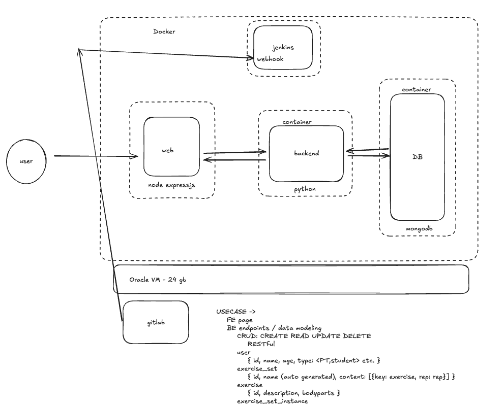
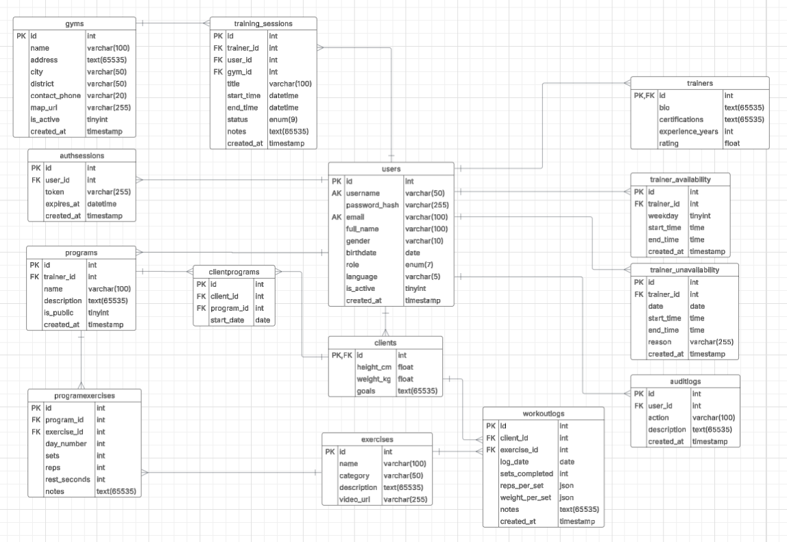

# Mefit – An Application for Gym Goers and PTs

Mefit is an app for gym goers to search for workout plans, book PTs to help with their goals, for PTs to create workout plans, adjust availabilities, both users can track progress of workouts.

## The Design of the App

## Use Cases

#### Use Case 1: Register/Log in
- **Actor**: Gym goers, PTs
- **Description**: Users shall be able to enter credentials (Email/username) to sign up or log in
- **Precondition**: User is not authenticated, email/username is not registered (For sign up)
- **Flow**:
  - User clicks on Sign up/ Log in
  - User then enters credentials (Email/username and password)
  - System validates credentials
  - On success, system redirects user to homepage
  - On failure, asks user to re-enter credentials
  - When signing up as a PT, the account must be verified by admin as official PT
- **Postcondition**: User is authenticated

#### Use Case 2: Browse Workout Plans
- **Actor**: Gym goers
- **Description**: Users shall be able to search and filter workout plans created by PTs
- **Precondition**: User is logged in, user's device is connected to Wi-Fi
- **Flow**:
  - User clicks on "Workout Plans"
  - System then displays workout plans in random order
  - User can filter plans by difficulties, muscle group, ratings, etc
  - User views plan's summary, description
- **Postcondition**: Users can select a plan to follow

#### Use Case 3: Create/Manage Workout Plans
- **Actor**: PTs
- **Description**: Users shall be able to create new plans or edit existing ones
- **Precondition**: User is logged in as a PT
- **Flow**:
  - User goes to "Manage Plans"
  - Here, user can choose between "Create new plan" or "Edit plan"
  - User fills in fields (plan name, description, sets, reps, duration)
  - User then can "Publish" or "Save to draft"
- **Postcondition**: Plan is available for gym goers to browse and is stored in database for further edits from PT

#### Use Case 4: Process Payments
- **Actor**: Gym goers
- **Description**: User shall be able to pay for PT sessions
- **Precondition**: A valid payment method is required
- **Flow**:
  - User choose a PT to book one-on-one sessions
  - System prompts user to enter payment method
  - User can choose between entering new payment credentials or "Select saved card"
  - System then processes payment and sends a receipt to user's email
- **Postcondition**: Transactions are logged

## Expected MVP Features

On launch, Mefit is expected to have the essential features that allow gym goers and PTs to interact and manage their fitness routines effectively. Users shall be able to sign up and log in with two separate roles (Gym goer and PT), create personalized profiles, and manage their workout plans – here, gym goers can view their chosen workout plans, progress and analytics, browse new workout plans while PTs can create new plans and publish them. A booking and scheduling system will also be launched which allows gym goers to book one-on-one sessions with a PT; and the PTs can set their availability. The sessions will be shown on users’ calendars. Mefit will includes a messaging feature where the reminders of plans, sessions, payment receipts will be sent to user’s phone or emai, and it will also help gym goer and PT to have direct conversations through chatbox.

## Data Modeling

For Mefit, data modeling plays an important role in organizing and managing user information, workouts, and tracking progress. Mefit will be structured around the following core entities: Users, Trainers, Workout Plans, Exercises, Progress Logs, and Transaction Logs. Each entity will contain specific attributes based on its role. For example, User entity will have attributes like UserID, UserName, DateOfBirth, UserEmail, and UserAge, while Workout Plan entity will include WorkoutGoal, WorkoutDuration, WorkoutExercises. And these entities will be connected through relationships: A user can follow multiple workout plans, each plan can have multiple exercises, and progress logs will be linked to specific plans and dates. This relational model will help ensure that all the data is structured logically and efficiently.

## Conclusion

Mefit provides a comprehensive solution for connecting gym goers with personal trainers, offering workout plan management, progress tracking, and seamless booking capabilities. The structured approach to data modeling and user experience design ensures scalability and user satisfaction. 